# 🧥 Virtual Thrift Store for CUET Campus

Welcome to the **Virtual Thrift Store for CUET Campus** — a user-friendly and sustainable platform where CUET students can buy, sell used items like clothes, books, gadgets, etc., within their campus community.

---

## 🚀 Getting Started for Freshers

### Prerequisites
Before running this project, make sure you have the following installed on your computer:
- **Node.js** (version 14 or higher) - [Download here](https://nodejs.org/)
- **MySQL** (version 8.0 or higher) - [Download here](https://dev.mysql.com/downloads/)
- **Git** - [Download here](https://git-scm.com/)
- A code editor like **VS Code** - [Download here](https://code.visualstudio.com/)

### Step-by-Step Installation

1. **Clone the Repository**
   ```bash
   git clone <repository-url>
   cd virtual-thrift-store-cuet
   ```

2. **Install Dependencies**
   ```bash
   npm install
   ```

3. **Set Up MySQL Database**
   - Open MySQL Workbench or MySQL Command Line
   - Create a new database:
     ```sql
     CREATE DATABASE cuet_thrift_store;
     ```
   - Import the database schema (if provided) or the system will create tables automatically

4. **Configure Environment Variables**
   - Create a `.env` file in the root directory
   - Add the following configuration (replace with your details):
     ```env
     DB_HOST=localhost
     DB_USER=your_mysql_username
     DB_PASSWORD=your_mysql_password
     DB_NAME=cuet_thrift_store
     PORT=3000
     SESSION_SECRET=your_secret_key_here
     ```

5. **Start the Application**
   ```bash
   npm start
   ```
   or for development mode:
   ```bash
   npm run dev
   ```

### 🎯 What You'll See After Running

Once you successfully run the project, here's what to expect:

1. **Terminal Output**
   ```
   Server is running on http://localhost:3000
   Database connected successfully
   ```

2. **Access the Application**
   - Open your web browser
   - Navigate to `http://localhost:3000`
   - You'll see the beautiful home page with product search functionality

3. **Available Pages to Explore**
   - **Home Page** (`/`) - Main landing page with featured products
   - **Sign Up** (`/signup`) - Register as a buyer or seller
   - **Login** (`/login`) - Access your account
   - **Products** (`/products`) - Browse all available items
   - **About Us** (`/about`) - Learn about the platform
   - **Contact** (`/contact`) - Get in touch
   - **Feedback** (`/feedback`) - Share your experience

4. **Test User Accounts**
   You can create test accounts or use these sample credentials (if set up):
   - **Buyer Account**: Any valid email
   - **Seller Account**: Must use CUET email (e.g., student@cuet.ac.bd)
   - **Admin Account**: Check with the system administrator

5. **First Steps to Try**
   - Register as a buyer with any email
   - Register as a seller with a CUET email
   - Browse products on the home page
   - Test the search functionality
   - Try adding items to cart/wishlist
   - Upload a product as a seller

### 🔧 Troubleshooting Common Issues

**Database Connection Error:**
- Ensure MySQL is running
- Check your database credentials in `.env`
- Make sure the database `cuet_thrift_store` exists

**Port Already in Use:**
- Change the PORT in `.env` file to a different number (e.g., 3001)

**Module Not Found:**
- Run `npm install` again
- Delete `node_modules` folder and run `npm install`

---

## 🌟 Key Highlights

- 🔍 **Powerful Home Page** – Beautifully designed landing page with product search functionality.
- 🧭 **Navigation Bar** – Includes: Sign Up / Login, Featured Products, About Us, Contact Us, Feedback, Admin Login.
- 🛍️ **Role-based Access** – Buyer (CUET students), Seller (Anyone), Admin (Single system admin).
- 💬 **Messaging System** – Buyers can contact sellers directly for any product.
- 🛒 **Wishlist & Cart** – Buyers can add products to their cart or wishlist for later.
- 🛠️ **Admin Control** – Admin can manage users, verify product statuses, and view daily sales.

---

## 👥 User Roles

### 👩‍🎓 Buyer (Anyone)
- View all available products.
- Contact sellers directly from the product page.
- Add products to **Cart** or **Wishlist**.
- View feedback and reach out via the **Contact Us** page.

### 🧑‍🔧 Seller (CUET Students Only)
- Upload product with image, description, and price.
- View uploaded product list.
- See messages from buyers on individual product listings.
- View list of products sold daily.

### 🛡️ Admin (Only One)
- View complete lists of **buyers** and **sellers**.
- See today's **sold products**.
- Change product status to **Active** or **Sold**.
- View full list of **sold items** historically.

---

## 📸 Screenshots

### 🏠 Home Page
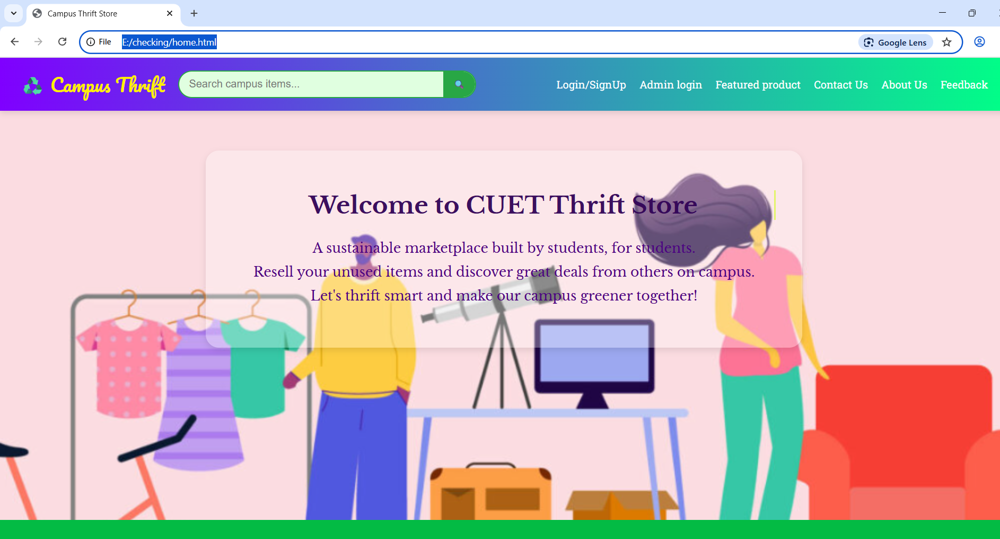

### 🔐 Login / Sign Up
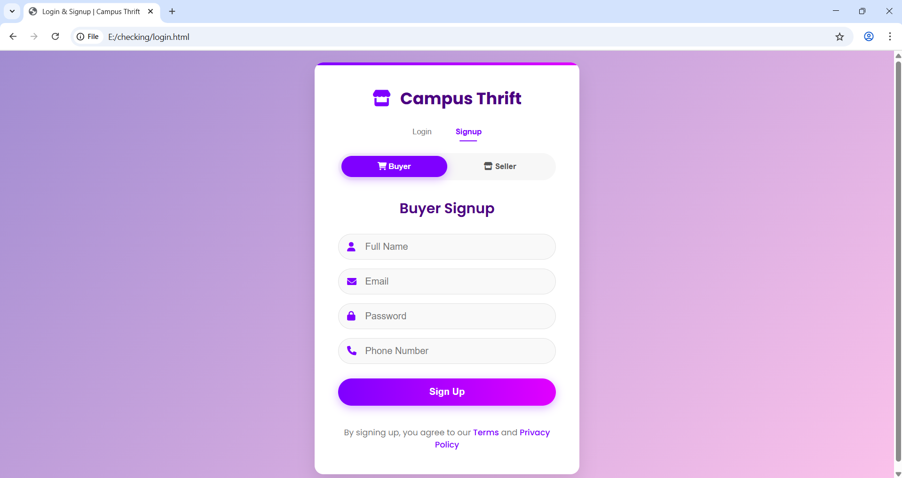

### 🛡️ Admin Dashboard

The Admin Dashboard provides multiple management features, fetching data dynamically from backend APIs (users and products).

#### Main Page
Displays an overview of all important statistics and data fetched from the backend APIs.
.jpg)

---

#### Managing Registered Sellers
Admins can view, approve, or remove registered sellers from the platform.
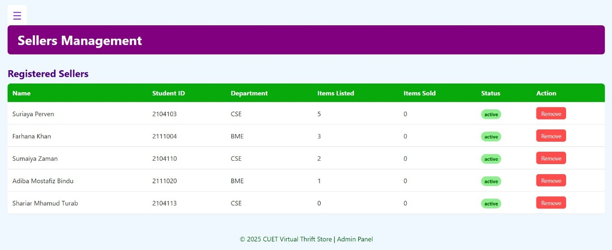

---

#### Managing Buyers
View and manage all registered buyers, including account details and activities.
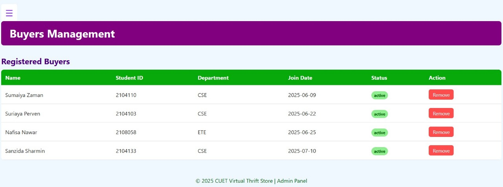

---

#### Sold Items History
Track sold through the platform, including buyer, seller and sale date.
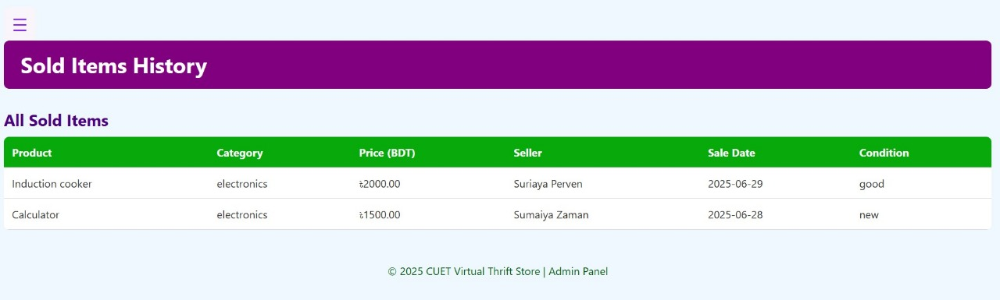

---

#### Managing All Listed Products
Admins can view, edit, or remove any products listed by sellers on the platform.
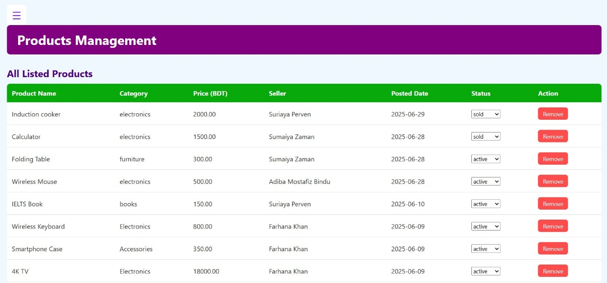

### 👩‍🎓 Buyer Dashboard

The Buyer Dashboard allows buyers to manage their purchases, personal data, saved items, and communicate with sellers. All data is dynamically loaded from backend APIs and connected to the database.

#### Main Page  
View all purchased products and saved items in one place, dynamically fetched from the backend.  
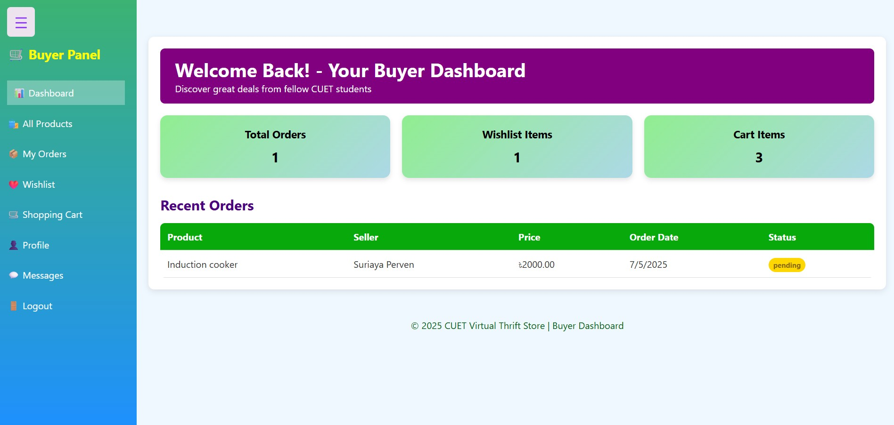

---

#### Products List (Dynamic)  
Browse the product list, dynamically loaded via backend APIs for real-time updates.  
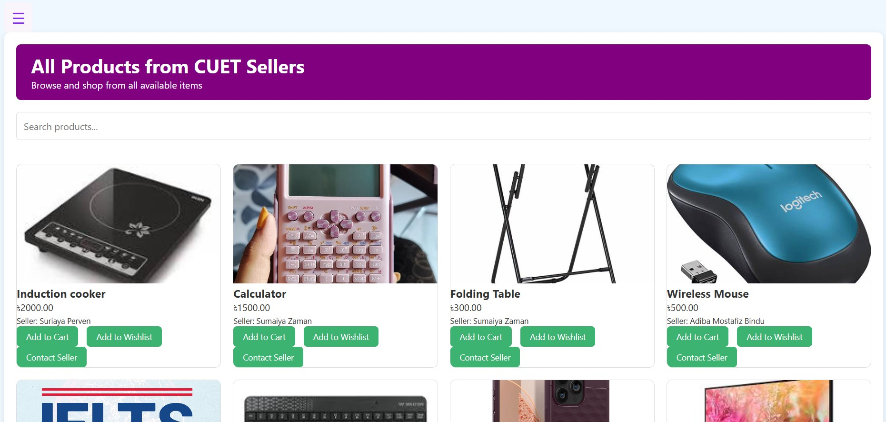

---

#### Check Order List  
Buyers can track and manage their past and current orders, connected directly to the database.  
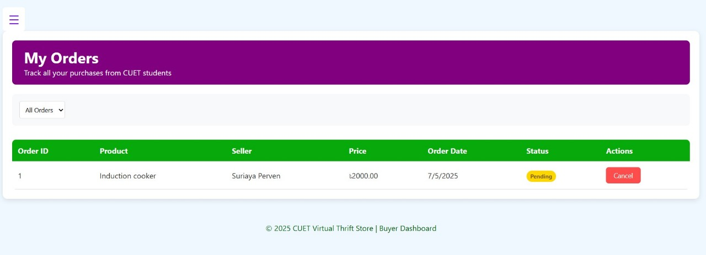

---

#### Manage Personal Info  
Easily update personal details like name, email, and address, connected to the database for instant updates.  
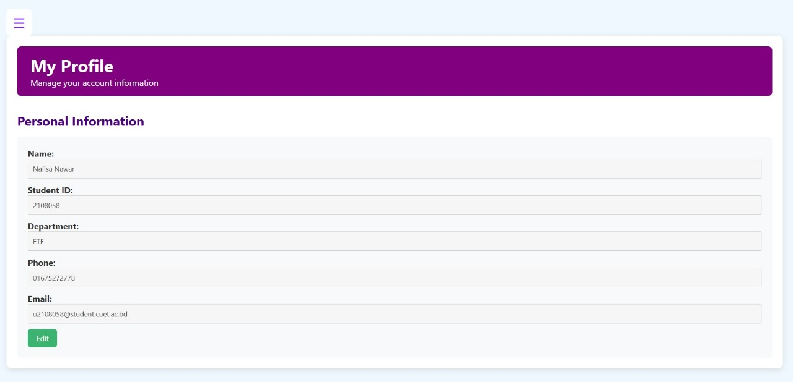

---

#### Messaging with Sellers  
Buyers can send and receive messages with sellers directly from the dashboard, making it easy to ask questions or negotiate deals.  
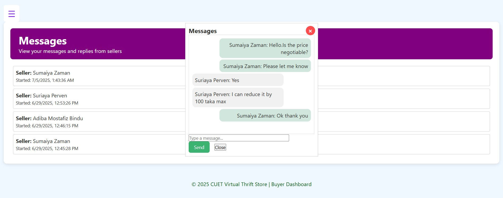

### 🧑‍🔧 Seller Dashboard

The Seller Dashboard allows sellers to manage their products and listings, all connected to the database for real-time updates.

#### Main Page  
Sellers can view their listed products directly from the dashboard.  
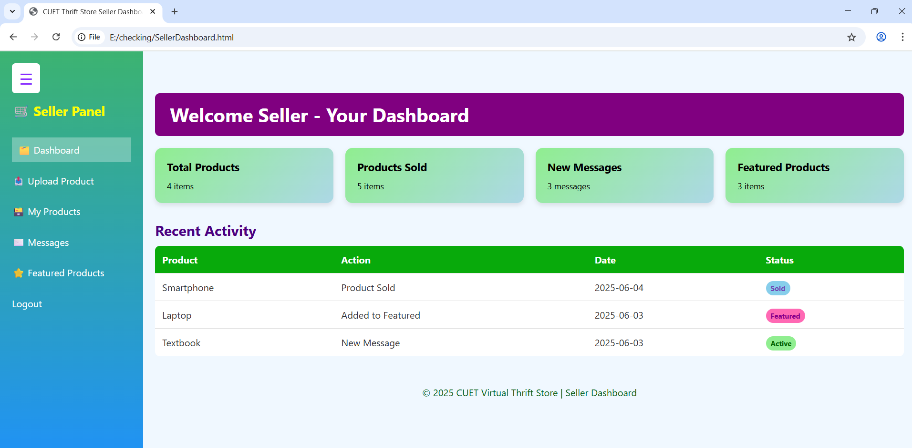

---

#### Uploading Products  
Sellers can upload new products with details like name, price, description, and images.  
.png)

### 💬 Messaging Page
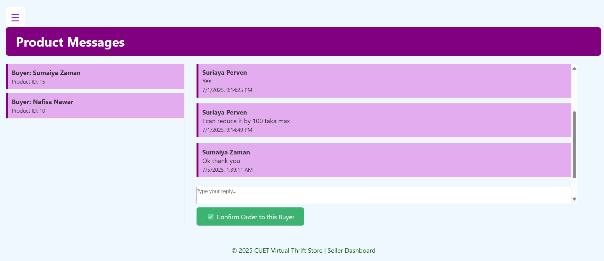

### 📝 About Us
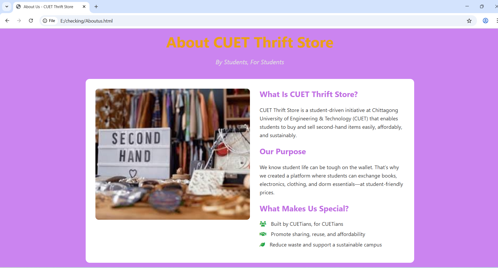

### 📩 Contact Page
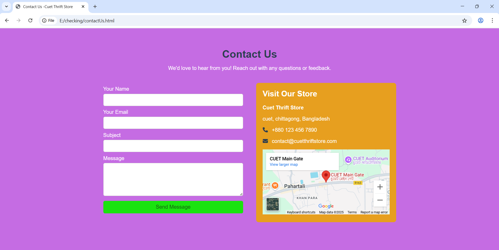

### 🗣️ Feedback Page
.jpg)

---

## ⚙️ Tech Stack

**Frontend**
- HTML5, CSS, JavaScript

**Backend**
- Node.js with Express.js
  
**Database**
- MySQL 

**Authentication**
- CUET email verification for sellers
- Session/token-based login for all users
- Role-based routing and access control

---

## 📂 Folder Structure

```
campus-thrift-backend/
├── node_modules/          # Dependencies (auto-generated)
├── uploads/              # Uploaded product images
├── .env                  # Environment variables
├── index.js             # Main server file
├── package-lock.json    # Dependency lock file
├── package.json         # Project configuration and dependencies
└── README.md           # Project documentation
```

**Key Files:**
- **index.js** - Main Node.js server file with Express routes
- **package.json** - Contains project dependencies and scripts
- **.env** - Database and server configuration
- **uploads/** - Directory for storing product images uploaded by sellers
- **node_modules/** - Auto-generated folder containing all npm packages

---

## 🤝 Contributing

1. Fork the repository
2. Create your feature branch (`git checkout -b feature/AmazingFeature`)
3. Commit your changes (`git commit -m 'Add some AmazingFeature'`)
4. Push to the branch (`git push origin feature/AmazingFeature`)
5. Open a Pull Request

---

## 📞 Support

If you encounter any issues or have questions:
- Check the troubleshooting section above
- Contact the development team
- Submit an issue on the repository

---

## 📝 License

This project is licensed under the MIT License - see the LICENSE file for details.
